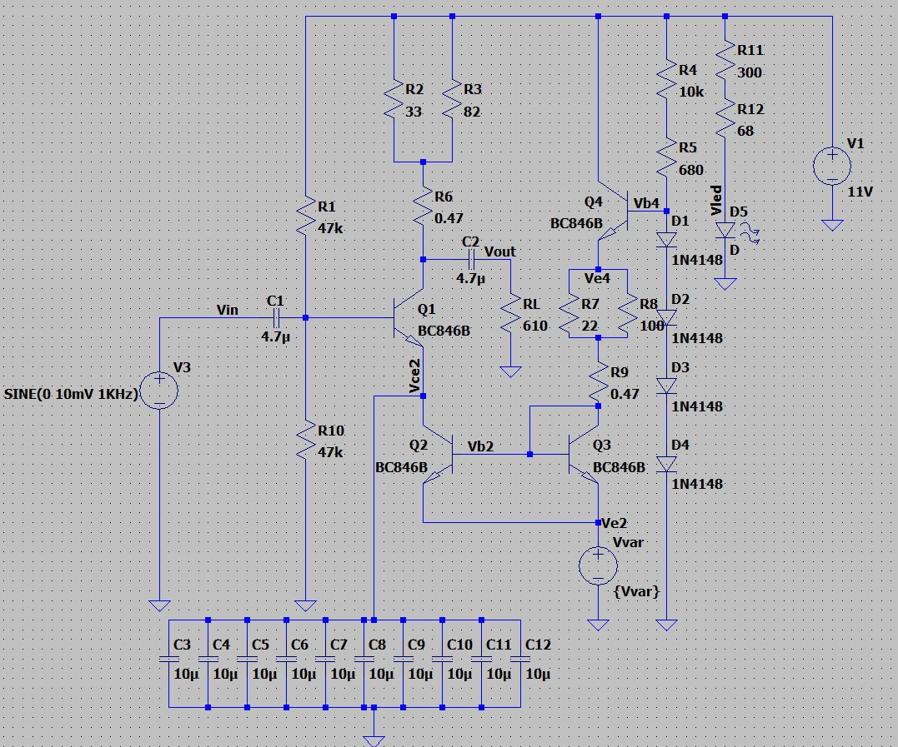
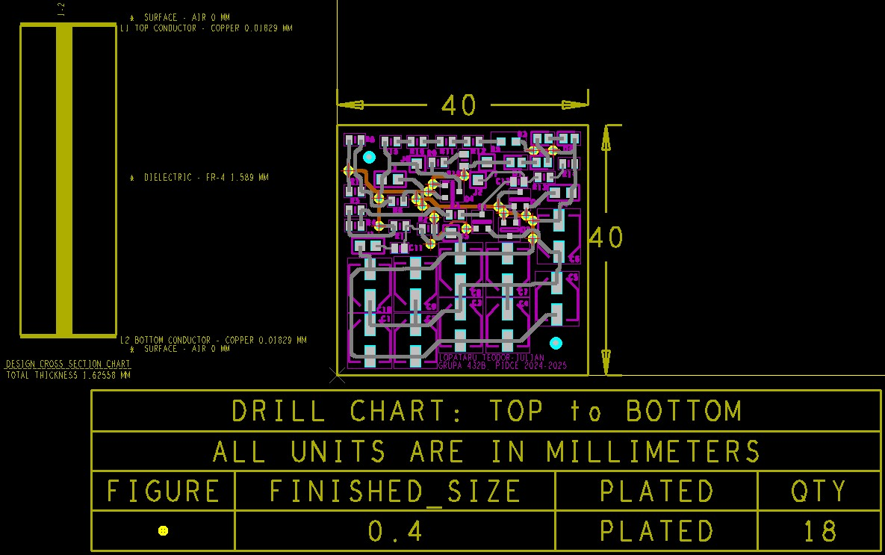
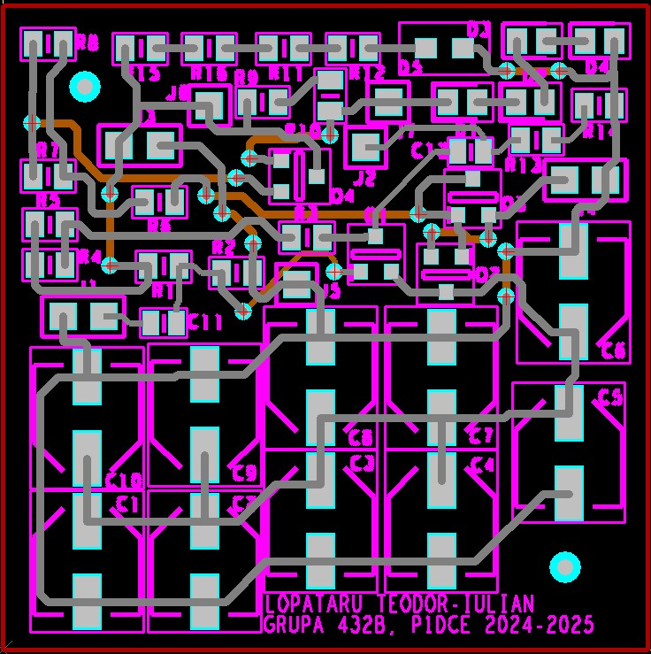
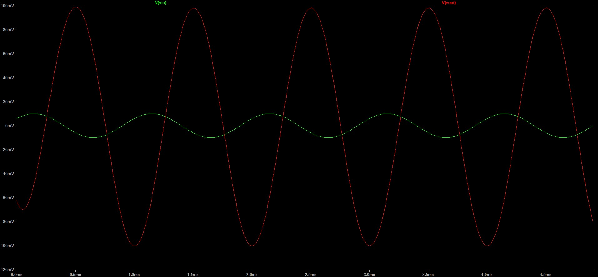
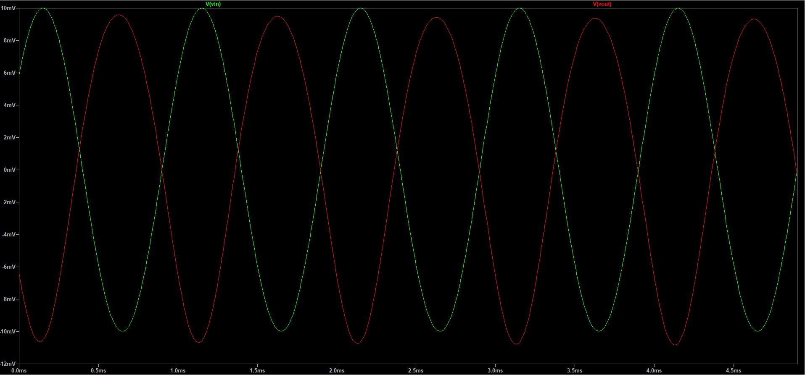

# Voltage-controlled Gain Audio Preamp
Project to design a Voltage-Controlled Audio Preamplifier. We had to implement a voltage control system that allows for automatic or manual adjustment of the amplification level using an external control voltage. This feature is particularly beneficial in applications such as audio mixers, sound processors, and compression systems within the audio industry.
By integrating analog electronics with control technology, the project delivers an efficient, versatile, and adaptable solution tailored to user requirements.
# Description
• Unipolar power supply (VCC=11V). Pressence of voltage is indicated by a LED.
 
• Input sinusoidal voltage with an amplitude between 0 and 30 mV and 1kHz frequency.
 
• DC voltage for gain control range [0, 1] V.
 
• Load resistance 600 Ω.
 
# Circuit schematic

 

# PCB design

# Voltage control

